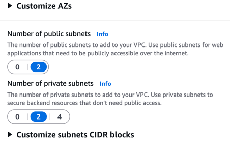
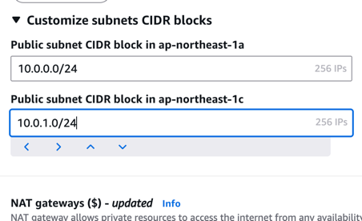

# AWS Computing
고가용성은 장애가 5분미만인 서비스를 의미한다.
    `고가용성은 성능이 떨어지면 안된다. 내결합성은 성능은 떨어질 수 있다.`
내결함성 - 이중화가 가능한지 보는 것  
고가용성 - 성능 + 비용 + 이중화
## 클라우드 컴퓨팅이란?
- 온디맨드로 서비스 액세스
- 필요에 따라 컴퓨팅 리소스 프로비저닝(공급, 할당)
- 사용한만큼만 비용 지불  

## 주요 이점
- 거대한 규모의 경제로 얻게 되는 이점
- 용량 추정 불필요
- 속도 및 민첩성 향상
- 비용 절감 목표 실현
- 몇 분 만에 전세게에 배포

가용영역 - 하나 이상의 데이터 센터  
리전 - 가용영역 3개 이상  
POP(Point of Presence, 엣지 로케이션) - 콘텐츠 캐시 영역

## 서비스 관리
관리 콘솔(Management Console)
명령줄 인터페이스(CLI, Command Line Interface)
소프트웨어 개발 키트(SDK, Software Development Kit)

## 공동 책임 모델 다이어그램
고객(클라우드 내부의 보안 담당)  
- 고객 데이터   
- 플랫폼, 애플리케이션, 자격 증명 및 액세스 관리
- 운영체제, 네트워크, 방화벽 구성
- 클라이언트 측 데이터, 암호화 및 데이터 무결성 인증
- 서버 측 암호화(파일 시스템 및 데이터)
- 네트워킹 트래픽 보호  

AWS(클라우드 자체의 보안 담당)
- 소프트웨어
- 컴퓨팅, 저장, 데이터베이스, 네트워킹
- 하드웨어/AWS 글로벌 인프라
- 리전, 가용영역, 엣지 로케이션

## IAM(Identity and Access Management)
1단계 - AWS 계정 만들기  
2단계 - 첫 번째 IAM 사용자를 생성 후 다른 사용자 생성 권한을 제공(Admin 계정 만들기)
IAM 사용자 - MFA 요구

### IAM 정책 
- 서비스 및 리소스 권한을 부여하거나 거부하는 문서
- JSON 요소
  - Version: 정책 언어의 버전을 정의
  - Effect: 액세스를 허용할지 또는 거부할지 여부를 지정
  - Action: 허용하거나 거부해야 하는 작업의 유형을 설명
  - Resource: 정책문에서 다루는 객체를 지정

## 컴퓨팅 서비스
### 인스턴스
  - EC2(Elastic Compute Cloud)
    - 가상 서버 프로비저닝
    - 시작할 때 먼저 AMI(Amazon Machine Image)를 선택
      - AMI 요소
        - 운영체제
        - 스토리지 매핑
        - 아키텍처 유형
        - 시작 권한
        - 추가 소프트웨어 애플리케이션
    - 지정한 AMI를 루트 디바이스에 볼륨에 복사
  - 인스턴스 유형
    - 범용
    - 컴퓨팅 최적화
    - 메모리 최적화
    - 가속 컴퓨팅
    - 스토리지 최적화
  - 가상머신(VM)  
    서버  
    호스트 운영체제  
    가상화 플랫폼  
    게스트 OS   
    애플리케이션  
    
### 컨테이너
    서버
    운영체제
    컨테이너
    애플리케이션

  - ECS(Elastic Container Service)
    - 운영체제 없음
  - EKS(Elastic Kubernetes Service)
    - MSA 설계를 위해 Kubernetes를 쓰기 시작하는 단계
      - 사용자가 많아질 때
      - 서비스 로직의 규모가 커지면서 장애가 발생하게 될 때
  
### 서버리스
  - 관리 할 필요가 없다는 의미, 서버가 없는게 아님
  - Fargate
  - Lambda

# AWS Networking
## VPC(Virtual Private Cloud)
데이터 센터의 기존 네트워크와 유사하게 AWS 클라우드에서 AWS 리소스를 위한 가상 네트워크를 정의하고 프로비저닝
### VPC를 생성 필요 요소
- 리전
- VPC의 이름
- VPC의 IP 주소 범위

VPC는 선택한 **리전의 여러 가용 영역**에 걸쳐있다.  
VPC 생성 후 **서브넷**을 생성  

서브넷
- 더 작은 네트워크
- 퍼블릭
  - 인터넷 연결
- 프라이빗
  - 인터넷 연결 안됨

클래스 없는 도메인 간 라우팅  
### CIDR(Classless inter-domain routing)
- IP 주소 범위를 지정하는데 사용되는 방법
- VPC를 생성할 때 IPv4 주소의 범위를 CIDR 블록으로 지정
- 192.168.1.0/24(192부터 1까지 고정)

### 인터넷 또는 원격 네트워크 액세스
- 인터넷 게이트웨이를 거쳐 인터넷을 통해 VPC에 연결
- 프라이빗 서브넷의 AWS 리소스들은 **NAT(Network Address Translation) 게이트웨이**를 통해 인터넷에 연결
- NAT 게이트웨이 => 나가는건 가능, 외부에서 접근은 불가능

VPC에 인터넷 게이트웨이를 붙여서 인터넷과 연결  
VPC안에 NAT 게이트웨이를 통해 외부에서 퍼블릭 서브넷에 접근  
프라이빗 서브넷에서 NAT 게이트웨이로 외부로 나감  
즉, 인바운드는 차단, 아웃바운드는 허용  
`최근에는 퍼블릿 서브넷에 로드밸런서만 두고, 나머지는 프라이빗 서브넷에 놓아서 보안을 강화함`

NACL(Network Access Control List) - 서브넷용 방화벽  
보안그룹 - EC2 방화벽

### `Default VPC가 있어서 EC2를 그냥 생성할 수 있지만 퍼블릭 서브넷 뿐이어서 보안상 위험하다VPC를 따로 생성하고, EC2를 프라이빗 서브넷에 두는 것이 좋다`

1. VPC에서 서브넷 설정
  
2. CIDR 설정을 통해 서브넷1, 2를 분리 지정

3. NAT 게이트웨이가 필요하면 설정
4. 보안그룹 생성
5. EC2 생성  
   Auto-assign public IP  
   - 브라우저에서 애플리케이션에 액세스할 수 있도록 인스턴스에 퍼블릭 IP 주소를 배정합니다.

`기존에는 Security Group은 하나의 VPC에 종속되어있었지만 VPC Association 기능을 통해서 VPC끼리도 Security Group을 공유할 수 있다.` 

# AWS Storage
- 블록 스토리지
  - 데이터 크기가 고정된 블록으로 디바이스에 저장
  - EC2 인스턴스 스토어
    - EC2 인스턴스용 블록 수준 임시 스토리지
    - EC2를 중지하거나 종료하면 데이터가 손실된다.
  - EBS(Elastic Block Storage)
    - 가용영역과 연결된 분리 가능 스토리지
    - EC2를 중지하거나 종료해도 데이터가 EBS 볼륨에 데이터를 계속 사용 가능
    - 볼륨 유형 
      - SSD
        - 간소한, 미드레인지 랜덤 워크로드
        - 고성능 스토리지 영역 네트워크(SAN) 교체
      - HDD
        - 매우 단순한 워크로드
        - 처리량이 높은 스트리밍 스타일 워크로드
        - 부트 디스크로는 사용 불가
- 파일 스토리지
  - EFS(Elastic File System)
    - AWS 클라우드 서비스 및 온프레미스 리소스와 함께 사용되는 확장 가능한 파일 시스템
    - 여러 가용영역에 걸쳐 EC2 인스턴스 연결을 지원
    - 온프레미스 서버는 AWS Direct Connect를 통해 Amazon EFS에 액세스 할 수 있음
- 객체 스토리지
  - 객체
    - 데이터
    - 메타 데이터
    - 키 
  - S3(Simple Storage Service)
    - Hash Table로 구현
    - 객체
    - 키
    - 버킷
    - 리전
    - 보안
      - IAM 정책
        - 사용자 그룹 및 역할에 연결
      - 버킷 정책
        - 버킷에 연결
      - S3 블록 퍼블릭 액세스
        - 퍼블릭 액세스 S3 리소스 관리
      - S3 암호화
        - 서버측 암호화
        - 클라이언트 측 암호화
    - S3 Standard : 기본 스토리지 클래스, 웹사이트 및 콘텐츠 배포 같은 범용 스토리지에 사용
    - S3 Standard IA(Infrequent Access) : 자주 접근 안하는 데이터이지만 가용성은 높은 상태
    - S3 One Zone-Infrequent Access : 액세스 빈도가 낮으며 손실되어도 쉽게 다시 생성할 수 있는 데이터, 가용 영역을 하나만 쓰는 것
    - S3 Glacier
      - Instant Retrieval
      - Flexible Retrieval
      - Deep Archive : 데이터 가져오는데 기본 1일  
      법률상 가지고 있어야하는 log 기록들을 저장해두는 용도로 사용해서 비용을 절감

# Database
## AWS RDS의 이점
- 목적별
- 완전 관리형
- 규모에 따른 성능
- 보안 및 고가용성  

## DB 유형
- 관계형
- 키-값
- 인 메모리
- 문서
- 와이드 컬럼
- 그래프
- 시계열
- 원장

## 데이터베이스 백업
자동 백업 : RDS는 DB 인스턴스의 스토리지 볼륨 스냅샷을 생성하여 전체 데이터베이스 및 트랜잭션 로그를 백업  
대기 시간 문제를 피하기 위해 데이터베이스 작업이 최소 상태일 때 30분 동안 백업하도록 설정하는 것이 좋음    

데이터베이스 스냅샷 : 35일보다 오래 백업을 보존하는 경우 DB 인스턴스의 수동 데이터베이스 스냅샷을 생성

### Multi AZ(Available Zone, 가용영역)  
Multi AZ 설정을 하면 RDS는 이중화를 위해 다른 가용 영역에 데이터베이스의 보조 사본을 생성  
`성능의 문제는 Multi AZ가 해결하지 못한다.`

## Amazon DynamoDB
완전 관리형 키-값 데이터베이스  
확장성 뛰어남  
저장 중 암호화 기능 제공  
`{
"PersonID":1001,
"Name":"Carlos_Salazr",
"Age":"25"
}`  
`{
"PersonID":1002,
"Name":"Nikki_worlf",
"Age":"28"
}`

# Monitoring, LoadBalancing 및 Scaling
# 강좌 요약